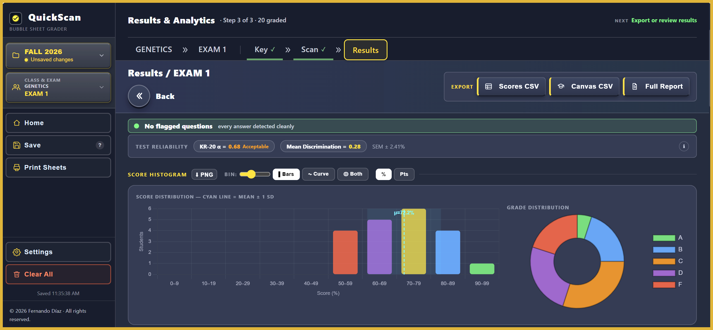
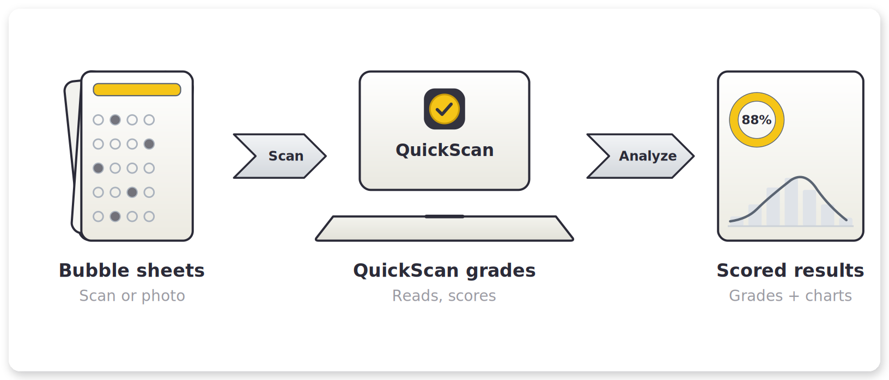
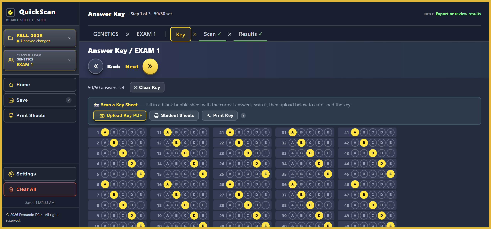
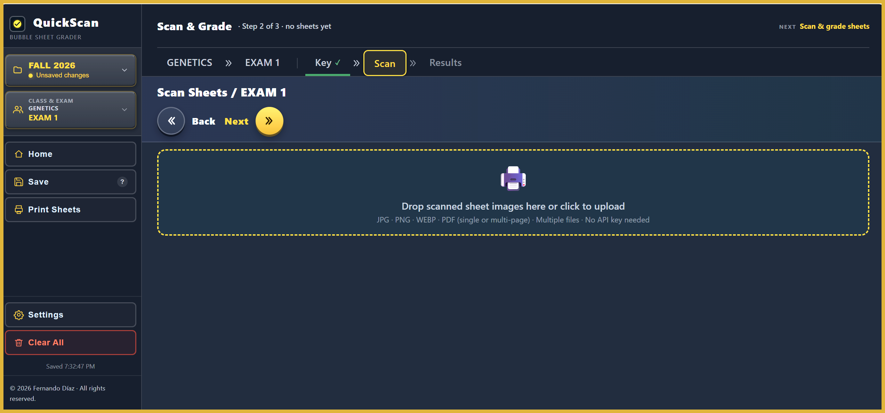
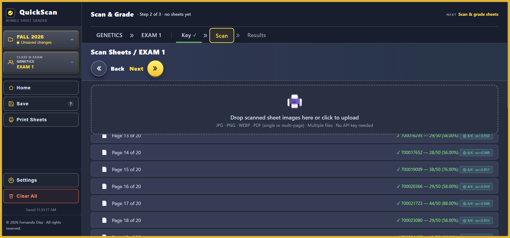
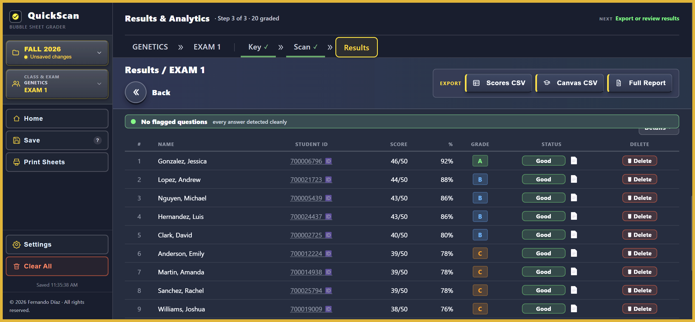

# QuickScan

**Automatically grades bubble-sheet exams. Faster than a Scantron machine, installs like an app, and works with no internet.**

[Live app](https://ferdiazfer.github.io/quickscan/) · [Sample exams](samples/) · [License](LICENSE)

---

## How it works

Scan your students' bubble sheets, QuickScan reads and grades them, and you get scored results with class analytics in seconds.

QuickScan runs entirely in your browser. There is no account, no server, no upload of student data anywhere, and no internet required once it is installed. It grades faster than a Scantron machine and adds class-level analytics a Scantron never gave you.

---

## Step by step

**1. Set the answer key**
Type the key, or scan a filled key sheet and QuickScan reads it (50 of 50 detected).

**2. Drop in your scanned sheets**
Scan or photograph the bubble sheets and drop them in. They grade automatically.

**3. Grade**
Every sheet is scored as it comes in, with the student ID read straight off the page.

**4. Review results**
A ranked score table, exportable to CSV or straight to your Canvas gradebook.

---

## What you get

- Grades a full class of bubble sheets in seconds, from a scan or a phone photo
- Reads the student ID off each sheet automatically
- Class analytics: score histogram, grade distribution, and per-question item analysis
- Test-reliability stats for those who want the detail (KR-20, Cronbach's alpha, item discrimination, distractor analysis)
- One-click export to a scores CSV or a Canvas-ready CSV
- Installs like an app and works fully offline, with no account and no data leaving your computer

---

## Install

**Download QuickScan** grabs a single file that opens in any browser and runs fully offline, no install step needed. Or open the [live app](https://ferdiazfer.github.io/quickscan/) and click install when your browser offers it. After that it runs offline like any installed app.

To try it right now with no printer or scanner, grade the ready-made set in [`samples/`](samples/): one answer key plus 20 filled student sheets.

---

## License

QuickScan is source-available software, not open source. See [LICENSE](LICENSE) for terms.

© 2026 Fernando Díaz. QuickScan is independent and unaffiliated; Scantron is a trademark of Scantron Corporation, referenced here only for comparison.
